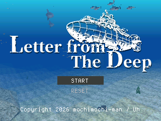

# Letter from The Deep TAB5

**[English](README.en.md) | [日本語](README.jp.md)**

Copyright 2026 mochimochi-man / Uh ([X: @calorie0](https://x.com/calorie0))

An ocean-exploration adventure game — or something that is not quite a game — running
on the ESP32-S3 and a 320x240 ST7789 panel.

## Story

> **Bristol, the 14th of March, 1783**
>
> **My dear Fenwick,**
>
> Well met, after so long. I have made a small discovery. I will not set it down here.
> You would not believe it written, and for my part I should like to see your face.
>
> I had meant to come up this spring, but I find I cannot. The work that has come out
> of the discovery is not a thing that can be left alone for a month, and the time the
> ascent and the return would cost me is out of the question. I am not willing to give
> it up. So I am asking you instead.
>
> There is a boat at the Floating Harbour, entered under your name. A closed-cycle
> hull. She will keep you down as long as your nerve holds. Take her as a gift. Do not
> be so quick to call the rest of it a nuisance.
>
> I shall not write down where I am. If I did, you would come straight to me and see
> nothing on the way, and the way is far the better part of it. Go down at the old
> stone gate and go as the fancy takes you. Put every ruin you find in your book. Every
> one of them. However absurd they look — and in truth, they are absurd.
>
> When the book is full you will understand what this place is. And then they will let
> you in.
>
> But I have grown somewhat tired of the view here. Come and fetch me.
>
> By the time you arrive, my work will be finished.
>
> Once your master, and now your servant,
>
> **S. MERROW**



## What you need

- ESP32-S3 N16R8 (16MB flash / 8MB OPI PSRAM)
- ST7789 SPI panel, 320x240
- A USB gamepad **or** a USB keyboard, on the USB host side

## Wiring

ST7789 (SPI, 80MHz)

| Panel | ESP32-S3 |
|---|---|
| SCLK | GPIO12 |
| MOSI | GPIO11 |
| DC | GPIO9 |
| CS | GPIO10 |
| MISO | not used |
| RST | tied to 3.3V. To drive it from a GPIO, change `PIN_TFT_RST` in `lgfx_setup.h` |
| BLK | tied to 3.3V. To drive it from a GPIO, change `PIN_TFT_BLK` in `lgfx_setup.h` |
| VCC | 3.3V |
| GND | GND |

## Build settings

Arduino IDE:

| Setting | Value |
|---|---|
| Board | ESP32S3 Dev Module |
| Flash Size | 16MB |
| PSRAM | OPI PSRAM |
| Partition Scheme | Custom (uses the bundled `partitions.csv`) |
| CPU Frequency | 240MHz |
| CDC On Boot | Disabled |
| USB Mode | Hardware CDC and JTAG |

On Windows you can build from PowerShell with `tools/build.ps1`:

```powershell
powershell -ExecutionPolicy Bypass -File tools\build.ps1
```

To build and flash:

```powershell
powershell -ExecutionPolicy Bypass -File tools\build.ps1 -Upload -Port COMxx
```

- The image is large enough that arduino-cli's own upload gives up part way through,
  so esptool is called directly.
- Install the **LovyanGFX** library.
- Rewrite the `directories` entries in `arduino-cli.yaml` for your own machine.

## Controls

With nothing plugged into the USB port, it runs on the touch panel.

| Input | Action |
|---|---|
| Left of the screen's centre | Move: forward, back and sideways |
| Right of the screen's centre | Turn left and right, look up and down |
| UP / DOWN | Rise / dive |
| BOOST | Hold for speed. |
| Tap the minimap | Expanded map → monuments → life → normal view |

### USB gamepad

| Input | Action |
|---|---|
| Left stick / D-pad | Move: forward, back and sideways |
| Right stick | Turn left and right, look up and down |
| Button 5 / Button 6 | Rise / dive |
| Button 1 (A) | Hold for speed. Confirm, in menus |
| Button 2 (B) | Cancel, in menus. In the city, returns while a panel is open |
| Button 10 (Start) | Expanded map → monuments → life → normal view |

Laid out for the Logicool F310. Numbering differs between makes, so adjust to the pad
you own.

### USB keyboard

| Key | Action |
|---|---|
| W / S (or ↑ / ↓) | Forward / back |
| A / D (or ← / →) | Strafe left / right |
| J / L | Turn left / right |
| I / K | Look up / down |
| Q / E | Rise / dive |
| Space | Hold for speed. Confirm, in menus |
| Esc (or Backspace) | Cancel, in menus. In the city, returns while a panel is open |
| Enter (or Tab) | Expanded map → monuments → life → normal view |

### Serial (115200bps, for debugging)

| Key | Action | Key | Action |
|---|---|---|---|
| `w` / `s` | Forward / back | `a` / `d` | Strafe |
| `h` / `l` | Turn | `i` / `k` | Look up / down |
| `u` / `o` | Rise / dive | `x` | Kill thrust and drift |
| `p` | Move the menu cursor | `g` | Confirm |
| `q` | Cancel | `v` | Switch panel |
| Space | Pause | `m` / `t` | Manual / tour camera |
| `r` / `n` / `1`–`5` | Back to the tour, then move | | |

## How to play

Explore the seas and find the monuments lying on the floor.

Pressing START\* during play opens the map and saves the current state. Each press of
START\* cycles map → monuments found → life found.
\*On the TAB5 alone, use the controls described above.

To erase the save, choose RESET on the title screen.

## License

Apache License 2.0. See `LICENSE` and `NOTICE` for the details.
